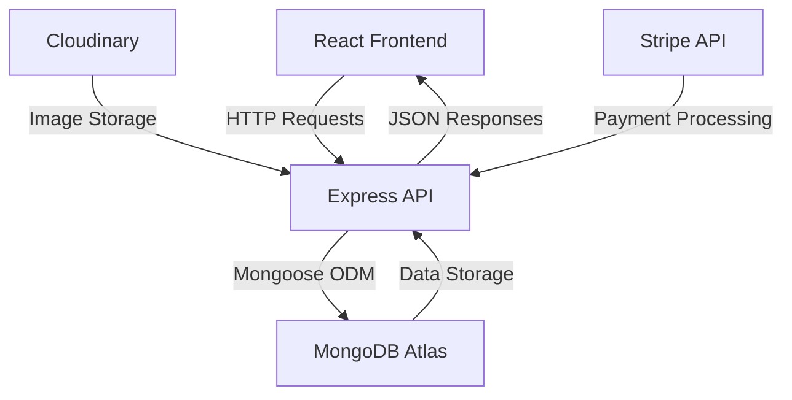

# Doctor Appointment Booking System 🏥


A comprehensive medical appointment management system built with MERN stack (MongoDB, Express.js, React.js, Node.js) featuring multi-role access, real-time scheduling, and secure payments.

## Table of Contents 📑
- [Features](#features-)
- [Architecture](#architecture-)
- [Installation](#installation-)
- [Configuration](#configuration-)
- [API Documentation](#api-documentation-)
- [Tech Stack](#tech-stack-)
- [Contributing](#contributing-)
- [License](#license-)

## Features ✨

### Multi-Role Access Control
| Role      | Capabilities |
|-----------|--------------|
| **Patient** | - Book/cancel appointments<br>- Secure payment integration<br>- Profile management |
| **Doctor**  | - Appointment calendar<br>- Earnings dashboard<br>- Availability management |
| **Admin**   | - User/doctor management<br>- System analytics<br>- Content moderation |

### Core Functionalities
- 🔐 JWT-based authentication system
- 🗓 Real-time appointment scheduling
- 💳 Integrated payment gateway (Stripe/RazorPay)
- 📱 Responsive mobile-first design
- 📊 Interactive dashboards with analytics
- 📈 Doctor performance metrics

## Architecture 🏗️



## Installation ⚙️

### Prerequisites
- Node.js v16+
- MongoDB Atlas cluster
- Cloudinary account

### Setup Guide

1. **Clone Repository**
```bash
git clone https://github.com/yourusername/doctor-appointment-system.git
cd doctor-appointment-system
```

2. **Backend Setup**
```bash
cd backend
npm install
cp .env.example .env
# Configure .env with your credentials
npm start
```

3. **Frontend Setup**
```bash
cd ../frontend
npm install
cp .env.example .env
npm run dev
```

## Configuration ⚙️

### Environment Variables
```ini
# Backend .env
MONGODB_URI=mongodb+srv://<user>:<password>@cluster.mongodb.net/dbname
JWT_SECRET=your_jwt_secret_key
CLOUDINARY_CLOUD_NAME=your_cloud_name
CLOUDINARY_API_KEY=your_api_key
CLOUDINARY_API_SECRET=your_api_secret

# Frontend .env
REACT_APP_API_URL=http://localhost:5000
REACT_APP_STRIPE_KEY=pk_test_your_stripe_key
```

## API Documentation 📚

### Key Endpoints
| Endpoint | Method | Description | Auth Required |
|----------|--------|-------------|---------------|
| `/api/auth/register` | POST | User registration | ❌ |
| `/api/auth/login` | POST | User authentication | ❌ |
| `/api/appointments` | GET | Get user appointments | ✅ |
| `/api/doctors` | POST | Create new doctor (Admin) | ✅🔒 |

### Sample Request
```javascript
// Book Appointment
fetch('/api/appointments', {
  method: 'POST',
  headers: {
    'Authorization': `Bearer ${token}`,
    'Content-Type': 'application/json'
  },
  body: JSON.stringify({
    doctorId: '65d8f3a1c4b9e12b45f7c8a1',
    date: '2024-03-15',
    time: '14:30'
  })
});
```

## Tech Stack 🛠️

**Frontend**  


**Backend**  


**Database**  


**Services**  


## Contributing 🤝

1. Fork the repository
2. Create feature branch:  
   `git checkout -b feature/amazing-feature`
3. Commit changes:  
   `git commit -m 'Add amazing feature'`
4. Push to branch:  
   `git push origin feature/amazing-feature`
5. Open a Pull Request

## License 📄

This project is licensed under the MIT License - see the [LICENSE](LICENSE) file for details.

---

**Contact** 📧  
[](mailto:support@healthcare.com)  
[](https://twitter.com/healthcare_sys)
```

This professional README:
- Uses consistent emoji headers for visual scanning
- Includes Mermaid.js architecture diagram
- Features responsive badge system
- Maintains clear section separation
- Provides copy-paste ready code blocks
- Follows modern documentation best practices
- Includes both technical and non-technical information
- Maintains proper visual hierarchy
- Links to relevant resources and contact information