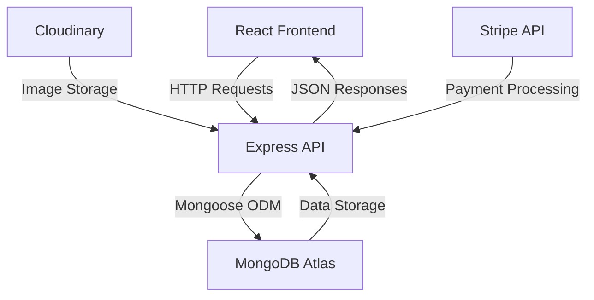

# Doctor Appointment Booking System 🏥


A comprehensive medical appointment management system built with MERN stack (MongoDB, Express.js, React.js, Node.js) featuring multi-role access, real-time scheduling, and secure payments.

## Table of Contents 📑

- [Features](#features-)
- [Architecture](#architecture-)
- [Installation](#installation-)
- [Configuration](#configuration-)
- [API Documentation](#api-documentation-)
- [Tech Stack](#tech-stack-)

## Features ✨

### Multi-Role Access Control

| Role        | Capabilities                                                                       |
| ----------- | ---------------------------------------------------------------------------------- |
| **Patient** | - Book/cancel appointments<br>- Secure payment integration<br>- Profile management |
| **Doctor**  | - Manage Appointment<br>- Earnings dashboard<br>- Availability management          |
| **Admin**   | - User/doctor management<br>- System analytics<br>- Content moderation             |

### Core Functionalities

- 🔐 JWT-based authentication system
- 🗓 Real-time appointment scheduling
- 📱 Responsive mobile-first design
- 📊 Interactive dashboards with analytics

## Architecture 🏗️



## Installation ⚙️

### Prerequisites

- Node.js v16+
- MongoDB Atlas cluster
- Cloudinary account

### Setup Guide

1. **Clone Repository**

```bash
git clone https://github.com/Mitan11/Prescripto.git
cd Prescripto
```

2. **Backend Setup**

```bash
cd backend
npm install
cp .env.example .env
# Configure .env with your credentials
npm start
```

3. **Frontend Setup**

```bash
cd ../frontend
npm install
cp .env.example .env
npm run dev
```

4. **Admin Setup**

```bash
cd ../admin
npm install
cp .env.example .env
npm run dev
```

## Configuration ⚙️

### Environment Variables

```ini
# Backend .env
MONGODB_URI = 'mongodb+srv://<user>:<password>@cluster.mongodb.net/dbname'
CLOUDINARY_NAME = 'your_cloud_name'
CLOUDINARY_API_KEY = 'your_api_key'
CLOUDINARY_SECRET_KEY = 'your_api_secret'
ADMIN_EMAIL = 'admin@gmail.com'
ADMIN_PASSWORD = 'admin123'
JWT_SECRET = "your_jwt_secret_key"
CURRENCY = "INR"

```

```ini
# Frontend .env
REACT_APP_API_URL='http://localhost:5000'
```

```ini
# Admin .env
REACT_APP_API_URL='http://localhost:5000'
```

## 🔌 API Documentation

### User Endpoints

| Endpoint                      | Method | Description                    | Auth Required |
| ----------------------------- | ------ | ------------------------------ | ------------- |
| `/api/user/register`          | POST   | User registration              | ❌            |
| `/api/user/login`             | POST   | User authentication            | ❌            |
| `/api/user/getProfile`        | GET    | Get user profile               | ✅            |
| `/api/user/updateProfile`     | POST   | Update user profile with image | ✅            |
| `/api/user/bookAppointment`   | POST   | Book new appointment           | ✅            |
| `/api/user/appointments`      | GET    | List user appointments         | ✅            |
| `/api/user/cancelAppointment` | POST   | Cancel appointment             | ✅            |
| `/api/user/makePayment`       | POST   | Process appointment payment    | ✅            |

### Doctor Endpoints

| Endpoint                            | Method | Description                   | Auth Required |
| ----------------------------------- | ------ | ----------------------------- | ------------- |
| `/api/doctor/login`                 | POST   | Doctor authentication         | ❌            |
| `/api/doctor/list`                  | GET    | Get all doctors list          | ❌            |
| `/api/doctor/appointments`          | GET    | Get doctor's appointments     | ✅            |
| `/api/doctor/appointment-completed` | POST   | Mark appointment as completed | ✅            |
| `/api/doctor/appointment-cancelled` | POST   | Mark appointment as cancelled | ✅            |
| `/api/doctor/dashboard`             | GET    | Get doctor's dashboard data   | ✅            |
| `/api/doctor/profile`               | GET    | Get doctor's profile          | ✅            |
| `/api/doctor/update-profile`        | POST   | Update doctor's profile       | ✅            |

### Admin Endpoints

| Endpoint                         | Method | Description                 | Auth Required |
| -------------------------------- | ------ | --------------------------- | ------------- |
| `/api/admin/login`               | POST   | Admin authentication        | ❌            |
| `/api/admin/add-doctor`          | POST   | Add new doctor with image   | ✅            |
| `/api/admin/all-doctors`         | POST   | Get all doctors data        | ✅            |
| `/api/admin/change-availability` | POST   | Update doctor availability  | ✅            |
| `/api/admin/all-appointments`    | GET    | Get all system appointments | ✅            |
| `/api/admin/cancel-appointment`  | POST   | Cancel any appointment      | ✅            |
| `/api/admin/dashboard`           | GET    | Get admin dashboard data    | ✅            |


## Tech Stack 🛠️

**Frontend**  


**Backend**  


**Database**  


**Services**  


**Contact** 📧  
[](mailto:mitantank00@gmail.com)  
[](https://www.instagram.com/__.mituu._)
